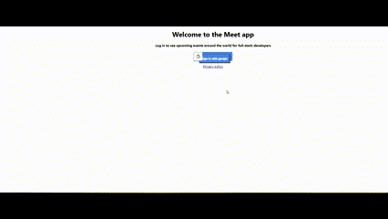

# Meet App

<!--
HOW TO USE:
This is an example of how you may give instructions on setting up your project locally.

Modify this file to match your project and remove sections that don't apply.

REQUIRED SECTIONS:
- Table of Contents
- About the Project
  - Built With
  - Live Demo
- Getting Started
- Authors
- Future Features
- Contributing
- Show your support
- Acknowledgements
- License

OPTIONAL SECTIONS:
- FAQ

After you're finished please remove all the comments and instructions!
-->

  

  <h3><b>README</b></h3>
  
   
    
 </a>

<!-- TABLE OF CONTENTS -->

# 📗 Table of Contents

- [📖 About the Project](#about-project)
  - [🛠 Built With](#built-with)
    - [Tech Stack](#tech-stack) 
    - [Features](#features) 
    - [User Stories and Scenarios](#User Stories and Scenarios)
    - [🚀 Live Demo](#live-demo)
- [👥 Authors](#authors)

<!-- PROJECT DESCRIPTION -->

# 📖 [Meet App] 

Meet App allows users to search for a city and get a list of events hosted in that city (or events in all cities). One chart shows how many events will take place in that city on upcoming days and another visualizes the popularity of event genres in the form of a pie chart. It is a progressive web application built with React using test-driven development (TDD) technique. The app works offline and it can be installed on both mobile devices and computers. Serverless functions are used(AWS Lambda) for the authorization server which generates authorization token(OAuth 2 token) needed in order to access the Google Calendar API and get events data. Scatter chart and pie chart are implemented to visualize data using the recharts library.

## 🛠 Built With 

### Tech Stack 

  
React, AWS Lamda, serverless, Jest, cucmber-jest, Puppeteer, Atatus etc.
  

(<a href="#readme-top">back to top</a>)

<!-- FEATURES -->

## Features 

Serverless functions deployed using AWS Lambda. -Performs Oauth and accesses Google Calender API via serverless functions -React Recharts visualization library -Jest test scripting for unit and integration testing -Enzyme for shallow rendering unit tests -Enzyme for full rendering integration tests -Puppeteer for user acceptance and end-to-end testing -Progressive Web Application

(<a href="#readme-top">back to top</a>)

<!-- User Stories and Scenarios -->

## User Stories and Scenarios 

  <h3> FEATURE 1: FILTER EVENTS BY CITY </h3> 
User story: As a user, I should be able to filter events by city so that I can see the events that take place in that city. 

Scenario 1: When user hasn’t searched for specific city, show upcoming events from all cities Given app is loaded

When: user hasn’t searched for any city.

Then: the user should see a list of all upcoming events
 

Scenario 2: user should see a list of suggestions when they search for city.

Given: the main page is open with the list of events in all cities

When: user starts typing the name of city in the text box

Then: the user should see a list of cities (suggestions) that match what they have typed
 

Scenario 3: When the user searches for city, a list of upcoming events in this city should be shown 
Given: the user was typing “Berlin†in the city textbox, and the list of suggested cities is showing 
When: user selects a city (e.g., “Berlin, Germany”) from the list of suggested cities 
Then: user city should be changed to the selected city (i.e. “Berlin, Germany”) and the user should receive a list of upcoming events in specified city

<h3>FEATURE 2: SHOW/HIDE AN EVENT'S DETAILS</h3> 

User story: As a user, I should be able to show/hide event details so that I can see more/less information about an event. 
 
Scenario 1: An event element is collapsed by default 
Given: app is loaded 
When: user receive the list of events in all cities (or specified city if searched) 
Then: user should see minimal informations about the listed events 
 
Scenario 2: User can expand an event to see its details 
Given: the main page is open with the list of events in all cities or specified city 
When: user clicks "show details" button for the associated event from the list 
Then: user should see more details of the event associated with the clicked button 
 
Scenario 3: User can collapse an event to hide its details 
Given: the main page is open with the list of upcoming events in all cities or specified city 
And: user has clicked "show details" button and details of event are shown 
When: user clicks "hide details" button for the associated event from the list 
Then: user should see less details of the event associated with the clicked button
 
 
<h3>FEATURE 3: SPECIFY NUMBER OF EVENTS </h3> 

User story: As a user, I should be able to specify the number of events I want to view in the app so that I can see more or fewer events in the events list at once. 
 
Scenario 1: When user hasn’t specified a number, 32 is the default number 
Given: user hasn’t specified a number 
When: user receives the list of events in all cities or specified city 
Then: user should see the list of 32 upcoming events in all cities or specified city 
 
Scenario 2: User can change the number of events they want to see 
Given: the main page is open with the list of events in all cities or specified city 
When: user specifies number of events to display 
Then: user receives specified number of events on the screen
 
 
<h3>FEATURE 4: USE THE APP WHEN OFFLINE</h3> 

User story: As a user, I should be able to use the app when offline so that I can see the events I viewed the last time I was online. 
 
Scenario 1: Show cached data when there’s no internet connection Given user doesn't have an internet connection 
When: user opens the app offline 
Then: user should see the data viewed last time user was online 
 
Scenario 2: Show error when user changes the settings (city, time range) 
Given: user opened the app offline and received the data viewed last time user was online 
When: user tries to change the setting (city, time and range) 
Then: user receives error message indicating that data is not available without internet connection
 
 
<h3>FEATURE 5: DATA VISUALIZATION</h3> 

User story: As a user, I should be able to see a chart showing the upcoming events in each city so that I know what events are organized in which city. 
 
Scenario 1: Show a chart with the number of upcoming events in each city 
Given: user receives the list of events in specified city which user has set 
When: user pushes the button "Visualize" 
Then: user should see a chart with the number of upcoming events in the specified city

(<a href="#readme-top">back to top</a>)

<!-- LIVE DEMO -->

## 🚀 Live Demo 

- [Live Demo Link](https://mcelest19.github.io/meet_app//)

(<a href="#readme-top">back to top</a>)

<!-- AUTHORS -->

## 👥 Authors 

👤 **Marina Celestino**

- GitHub: [@githubhandle](https://github.com/Mcelest19)
- LinkedIn: [LinkedIn](https://www.linkedin.com/in/marina-celestino-90319a166/)

(<a href="#readme-top">back to top</a>)
 
